# Specgraph

A minimal implementation of GitHub's [spec-kit](https://github.com/github/spec-kit) specification workflows using **LangGraph** for orchestration and Anthropic Claude for content generation.

## Overview

Specgraph demonstrates how to build specification-driven development workflows using [LangGraph](https://langchain-ai.github.io/langgraph/), a library for building stateful, multi-step LLM applications as explicit graphs. Each workflow phase (specify, plan, tasks, clarify) is implemented as a compiled StateGraph with typed state management, conditional routing, and error handling.

### Why LangGraph?

LangGraph provides:

- **Explicit state management** - TypedDict-based state that flows through graph nodes
- **Transparent execution flow** - Clear visualization of workflow steps and transitions
- **Conditional routing** - Dynamic path selection based on state
- **Error handling** - Built-in state propagation for validation and error states
- **Composability** - Modular node functions that can be reused across workflows

## LangGraph Architecture

### Core Workflow Pattern

Each workflow follows this LangGraph pattern:

```python
from langgraph.graph import StateGraph, START, END
from typing import TypedDict

# 1. Define typed state
class WorkflowState(TypedDict):
    input: str
    result: str
    error: str | None

# 2. Define node functions
def process_node(state: WorkflowState) -> dict:
    """Nodes return partial state updates."""
    return {"result": f"Processed: {state['input']}"}

# 3. Build and compile graph
workflow = StateGraph(WorkflowState)
workflow.add_node("process", process_node)
workflow.add_edge(START, "process")
workflow.add_edge("process", END)
app = workflow.compile()

# 4. Execute with initial state
result = app.invoke({"input": "data", "result": "", "error": None})
```

## Installation

1. Create a virtual environment and install dependencies:

```bash
uv venv
source .venv/bin/activate  # On Windows: .venv\Scripts\activate
uv pip install -e .
```

2. Set up your Anthropic API key:

```bash
export ANTHROPIC_API_KEY='your-api-key-here'
```

## Quick Start

```bash
# 1. Install
uv venv && source .venv/bin/activate
uv pip install -e .

# 2. Configure
export ANTHROPIC_API_KEY='your-key'

# 3. Run the workflow sequence
acpctl specify "Build a photo album organizer"
acpctl plan "Use Python and FastAPI"
acpctl tasks
acpctl clarify  # Interactive Q&A
```

**Output Structure**:

```
specs/001-build-photo-album-organizer/
├── specification.md  # Product requirements
├── plan.md          # Technical architecture
└── tasks.md         # Implementation tasks
```

## Project Structure

```
specgraph/
├── src/specgraph/
│   ├── workflows/      # LangGraph workflow definitions
│   ├── prompts/        # Claude prompt templates
│   ├── utils/          # File management utilities
│   └── cli.py          # Click CLI interface
└── specs/              # Generated specifications (gitignored)
```

## Implemented LangGraph Workflows

### Workflow Visualizations

```mermaid
%%{init: {'theme':'base', 'themeVariables': { 'primaryColor':'#1f77b4','primaryTextColor':'#fff','primaryBorderColor':'#1f77b4','lineColor':'#666','secondaryColor':'#ff7f0e','tertiaryColor':'#2ca02c'}}}%%

flowchart TD
    Start1((START)) --> A1[analyze_input]
    A1 --> C1{error?}
    C1 -->|yes| End1((END))
    C1 -->|no| G1[generate_specification]
    G1 --> S1[save_specification]
    S1 --> End1

    Start2((START)) --> L2[load_specification]
    L2 --> C2{error?}
    C2 -->|yes| End2((END))
    C2 -->|no| G2[generate_plan]
    G2 --> S2[save_plan]
    S2 --> End2

    Start3((START)) --> L3[load_spec_and_plan]
    L3 --> C3{error?}
    C3 -->|yes| End3((END))
    C3 -->|no| G3[generate_tasks]
    G3 --> S3[save_tasks]
    S3 --> End3

    Start4((START)) --> L4[load_specification]
    L4 --> C4{answers<br/>provided?}
    C4 -->|no| A4[analyze_and_generate_questions]
    A4 --> End4((END))
    C4 -->|yes| U4[update_with_answers]
    U4 --> S4[save_updated_specification]
    S4 --> End4

    subgraph "1. Specify Workflow"
        Start1
        A1
        C1
        G1
        S1
        End1
    end

    subgraph "2. Plan Workflow"
        Start2
        L2
        C2
        G2
        S2
        End2
    end

    subgraph "3. Tasks Workflow"
        Start3
        L3
        C3
        G3
        S3
        End3
    end

    subgraph "4. Clarify Workflow (Dual-Phase)"
        Start4
        L4
        C4
        A4
        U4
        S4
        End4
    end

    style Start1 fill:#2ca02c
    style Start2 fill:#2ca02c
    style Start3 fill:#2ca02c
    style Start4 fill:#2ca02c
    style End1 fill:#d62728
    style End2 fill:#d62728
    style End3 fill:#d62728
    style End4 fill:#d62728
    style C1 fill:#ff7f0e
    style C2 fill:#ff7f0e
    style C3 fill:#ff7f0e
    style C4 fill:#ff7f0e
```



### 1. Specify Workflow (`specify.py`)

Generates product specifications from feature descriptions.

**State Definition**:

```python
class SpecifyState(TypedDict):
    feature_description: str
    specification: str
    spec_path: Path
    spec_number: int
    error: str | None
```

**Graph Structure**:

```
START → analyze → [conditional] → generate → save → END
                    ↓ (if error)
                   END
```

**Node Functions**:

- `analyze_input` - Validates feature description (min 10 chars)
- `generate_specification` - Calls Claude to create PRD with user stories, requirements, success criteria
- `save_specification` - Creates `specs/NNN-feature-name/specification.md`
- `should_continue` - Conditional routing: skip generation if validation fails

**Key Pattern**: Error state propagation - validation errors in `analyze` prevent downstream nodes from executing via conditional edge.

### 2. Plan Workflow (`plan.py`)

Generates technical implementation plans from specifications.

**State Definition**:

```python
class PlanState(TypedDict):
    spec_path: Path | None
    specification: str
    technical_constraints: str
    plan: str
    plan_file: Path
    error: str | None
```

**Graph Structure**:

```
START → load_spec → [conditional] → generate_plan → save_plan → END
                      ↓ (if error)
                     END
```

**Node Functions**:

- `load_specification` - Finds and loads latest spec from filesystem
- `generate_plan` - Calls Claude with spec + constraints to create technical plan
- `save_plan` - Appends `plan.md` to specification directory
- `should_continue` - Conditional routing based on spec load success

**Key Pattern**: Filesystem integration - graph nodes handle file I/O, state carries Path objects.

### 3. Tasks Workflow (`tasks.py`)

Generates detailed task breakdowns following Spec-Kit conventions.

**State Definition**:

```python
class TasksState(TypedDict):
    spec_path: Path | None
    specification: str
    plan: str
    tasks: str
    tasks_file: Path
    error: str | None
```

**Graph Structure**:

```
START → load_spec_and_plan → [conditional] → generate_tasks → save_tasks → END
                               ↓ (if error)
                              END
```

**Node Functions**:

- `load_specification_and_plan` - Loads both `specification.md` and `plan.md`
- `generate_tasks` - Calls Claude to create phased task list with parallel markers
- `save_tasks` - Creates `tasks.md` with file paths and dependencies

**Key Pattern**: Multi-document input - state accumulates multiple file contents for LLM context.

### 4. Clarify Workflow (`clarify.py`)

Interactive workflow for resolving specification ambiguities.

**State Definition**:

```python
class ClarifyState(TypedDict):
    spec_path: Path | None
    specification: str
    questions: list[dict] | None
    answers: dict[int, str] | None
    updated_spec: str
    error: str | None
```

**Graph Structure** (Two-Phase):

**Phase 1 - Question Generation**:

```
START → load_spec → [conditional] → analyze_questions → END
                      ↓ (if error)
                     END
```

**Phase 2 - Spec Update**:

```
START → load_spec → [conditional] → update_with_answers → save_spec → END
                      ↓ (if error)
                     END
```

**Node Functions**:

- `load_specification` - Loads current spec
- `analyze_and_generate_questions` - Claude analyzes spec, returns JSON questions array
- `update_with_answers` - Claude incorporates user answers into spec
- `save_updated_specification` - Overwrites `specification.md`

**Key Patterns**:

- **Dual invocation** - Workflow run twice with different state (questions → answers)
- **JSON extraction** - Parsing structured LLM output from markdown code blocks
- **Interactive state** - CLI collects answers between graph invocations

## LangGraph Design Patterns Used

### 1. **Typed State Management**

All workflows use `TypedDict` for compile-time type safety and runtime state validation:

```python
class SpecifyState(TypedDict):
    feature_description: str  # Input
    specification: str        # Intermediate
    spec_path: Path          # Output
    error: str | None        # Control flow
```

### 2. **Conditional Error Routing**

Validation errors short-circuit workflows using conditional edges:

```python
def should_continue(state: State) -> str:
    return END if state.get("error") else "next_node"

workflow.add_conditional_edges(
    "validate",
    should_continue,
    {"next_node": "next_node", END: END}
)
```

### 3. **Partial State Updates**

Nodes return only changed fields - LangGraph merges them into full state:

```python
def node(state: State) -> dict:
    # Return only what changed
    return {"result": "new value"}
```

### 4. **Separation of Concerns**

- **Nodes** - Pure functions doing one thing (validate, generate, save)
- **Graph** - Orchestration and control flow
- **State** - Data contract between nodes
- **Prompts** - LLM instructions (separate module)

### 5. **Graph Compilation**

Workflows are compiled once, invoked many times:

```python
# Build time
workflow = build_specify_workflow()  # Returns compiled graph

# Runtime (multiple invocations)
result1 = workflow.invoke(state1)
result2 = workflow.invoke(state2)
```

## CLI Usage

The `acpctl` CLI wraps LangGraph workflows for command-line execution:

```bash
# Generate specification
acpctl specify "Build a photo album organizer with drag-and-drop"

# Generate technical plan
acpctl plan "Use Python with FastAPI and PostgreSQL"

# Generate task breakdown
acpctl tasks

# Clarify ambiguities (interactive)
acpctl clarify
```

## Development

### Linting

Run linters before committing:

```bash
black src/
isort src/
flake8 src/ --ignore=E501
```

### Adding New Workflows

To add a new LangGraph workflow:

1. **Define state** in `src/specgraph/workflows/your_workflow.py`:

   ```python
   class YourState(TypedDict):
       input: str
       output: str
       error: str | None
   ```

2. **Create node functions** (each returns partial state):

   ```python
   def process(state: YourState) -> dict:
       return {"output": f"Processed {state['input']}"}
   ```

3. **Build graph**:

   ```python
   def build_workflow() -> StateGraph:
       workflow = StateGraph(YourState)
       workflow.add_node("process", process)
       workflow.add_edge(START, "process")
       workflow.add_edge("process", END)
       return workflow.compile()
   ```

4. **Add CLI command** in `src/specgraph/cli.py`:

   ```python
   @cli.command()
   def your_command():
       result = build_workflow().invoke(initial_state)
   ```

## Key Takeaways for LangGraph Users

1. **State is king** - Design your TypedDict carefully; it's your data contract
2. **Nodes are pure** - Keep side effects (file I/O, API calls) isolated in specific nodes
3. **Conditionals enable flexibility** - Use `add_conditional_edges` for dynamic routing
4. **Error handling via state** - Propagate errors through state fields, not exceptions
5. **Compile once, invoke many** - Compilation is expensive; cache the compiled graph

## License

MIT
